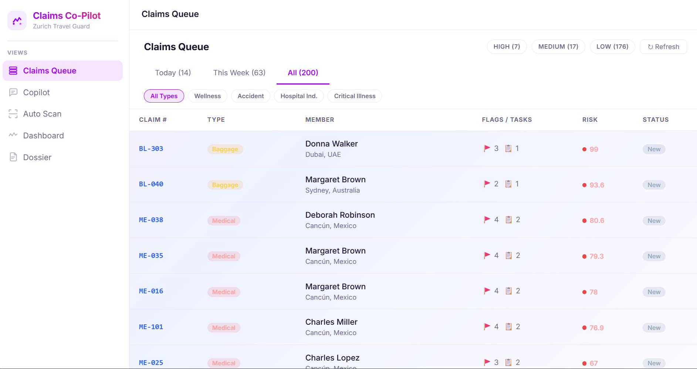
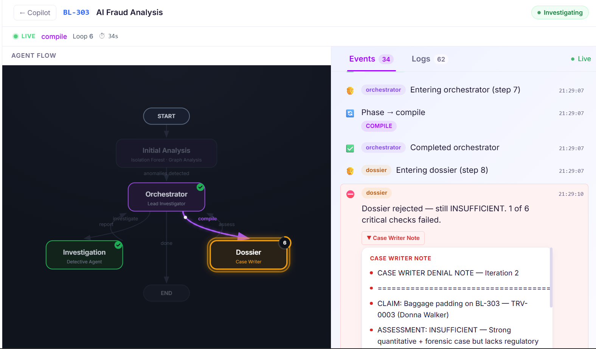
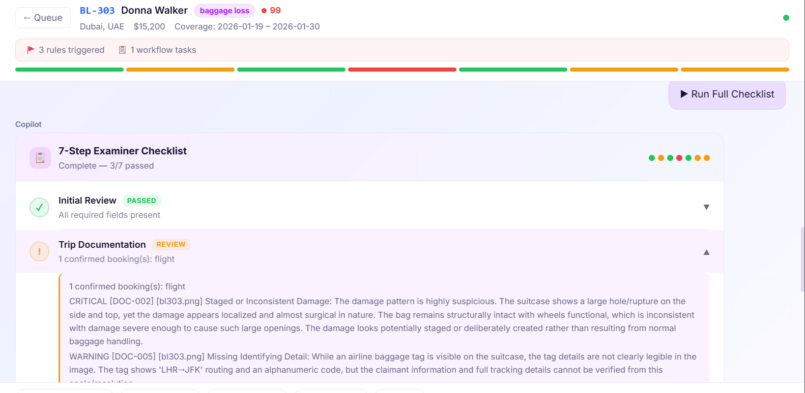
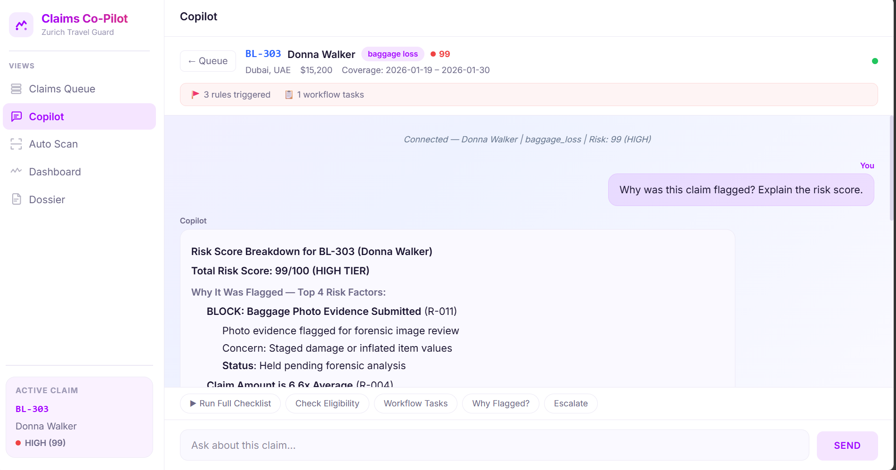

# Claims Copilot

### The agentic AI that reviews any insurance claim like your best examiner — for any line of business.

Claims Copilot is an AI workflow platform that examines claims the way your most experienced
adjuster would: it reads the documents, *looks* at the evidence, connects the dots across
people and providers, scores the risk, and writes up its findings — automatically. It doesn't
just flag claims faster. It **automates the thinking** behind the decision, then hands your
examiner a defensible, audit-ready recommendation. And because it's domain-agnostic, the same
platform runs your health book today and your auto, travel, life, or property book tomorrow —
with a configuration change, not a rebuild.

---

## The problem it solves

- Claim review is **slow and inconsistent** — every examiner works differently, and quality
  rides on who happens to pick up the file.
- Examiners are **drowning in documents** and toggling between five disconnected systems to
  answer one question.
- The costliest fraud is **invisible in a single claim** — rings, mills, and coordinated filing
  only show up when you connect claims to each other.
- Decisions are **hard to defend** — reconstructing "why did we pay this?" after the fact eats
  hours and creates audit risk.

---

## What Claims Copilot does

It sits on top of your claim intake and runs every claim through one intelligent workspace:

```
  Claims  →  Risk scoring + Rules + Vision AI + Network graph  →  Agentic copilot + Checklist  →  Decision + Auto-Dossier
```

The examiner opens a prioritized **queue**, chats with a claim-aware **copilot**, watches it run
a structured **checklist**, sees portfolio-wide risk on a **dashboard**, and exports a complete
**dossier** — all in one place.



> **One queue for the whole book.** Every incoming claim is scored and ranked the moment it
> arrives — HIGH / MEDIUM / LOW tiers, flags, and open tasks at a glance — so examiners spend
> their day on the claims that actually matter instead of working the pile top-to-bottom.

---

## The four things that make it different

### 🧠 Agentic — it automates the thinking
This is not a dashboard you read. It's an agent that *reasons*. Claims Copilot autonomously runs
the full examiner checklist, decides which checks a given claim actually needs, pulls the
evidence, follows the thread when something looks off, and compiles its conclusion. It keeps
investigating until the evidence is sufficient — then writes the case up for you. Your examiners
stop doing the busywork and start doing the judgment.



> **Watch the AI investigate, step by step.** A lead "Orchestrator" agent directs a "Detective"
> investigator and a "Case Writer," looping through the evidence in real time. When the write-up
> isn't strong enough, the agent **rejects its own dossier** ("still INSUFFICIENT — 1 of 6
> critical checks failed") and digs deeper — exactly the discipline you'd want from a senior
> examiner, with every event and log fully transparent.



> **One automated checklist, not seven manual systems.** Instead of an examiner jumping from
> eligibility to policy to documents to fraud tools, Claims Copilot runs all seven review steps
> in a single pass — auto-passing the routine ones (green) and surfacing only what needs a human
> eye (amber/red). Here the Vision AI has already flagged "staged or inconsistent damage" on the
> baggage photo and routed the step for review.

### 👁 Vision AI — it sees the evidence
Most fraud tools only read metadata. Claims Copilot **looks at the actual images** — damage
photos, receipts, medical records, police reports, invoices — and runs a 13-point forensic
inspection: digital manipulation, staged or inconsistent damage, stock/reused images, altered
amounts and dates, missing official markings, screenshots-of-a-screen, and issuer mismatches.
It catches the tampering a human skimming a PDF would miss.

### 🕸 Network analysis — the holistic view
Single-claim review is blind to the most expensive fraud. Claims Copilot builds an **entity
graph** linking members, dependents, providers, facilities, addresses, policies, and claims —
so it sees the *whole network*, not one claim at a time. That's how it surfaces **fraud rings,
shared-address clusters, provider mills, and benefit-stacking** that look perfectly normal one
claim at a time.

### 🌐 Domain agnostic — built once, sold to anyone
The platform's intelligence is configuration, not code. It ships with **two live lines of
business today — supplemental health and travel** — and adding a new one (auto, life, property,
workers' comp) is a documented, repeatable recipe. The queue, checklist, dossier, and entire UI
are data-driven, so a new client or product line means a config swap, **not a rebuild**. One
investment, reusable across every book you write.

---

## Fraud signals it catches

Three common red flags — and how Claims Copilot catches each:

**1. Different and changing fonts on medical records.** The **Vision AI** catches this directly.
It runs a forensic inspection on the actual document image and flags font inconsistency — mixed
font styles or families within a single page — as a tampering signal (cut-and-paste edits to
medical records). It maps to the document checks (font-consistency / visual-inconsistency rules)
and routes the claim for review instead of auto-passing it.

**2. High-volume claim submissions.** Caught by the **rules engine + network analysis.** A
provider or member pushing abnormally high claim volume trips the provider-volume / claim-mill
rules, and the **entity graph** spots the pattern holistically — a single provider tied to dozens
of claims, or burst-filing across linked members — which is invisible when you look at one claim
at a time.

**3. Using computers to alter medical records.** This is the digital-manipulation case, and again
the **Vision AI** is the front line: it looks for signs of digital editing — cloning, warped
edges, mismatched lighting, altered amounts or dates, screenshot-of-a-screen artifacts, and source
mismatches (e.g. a member-uploaded mobile scan when the provider's records should come straight
from the source). Low document-integrity scores flag the record as likely manipulated and hold it
for forensic review.

> **The throughline:** all three are exactly what Claims Copilot is built to catch. Vision AI
> *sees* tampered documents, the rules engine scores the risk, and network analysis exposes the
> volume and coordination patterns — then the agent compiles it into an explainable, audit-ready
> finding.

---

## What it means for your business

| | What you get |
|---|---|
| **Productivity & cost** | **5 systems into 1.** Eligibility, policy admin, rules, workflow tasks, and fraud screening live in a single workspace — your examiners stop toggling between tools. |
| **Lower loss leakage** | **Catches fraud the eye can't see** — rings, provider mills, and document-tampering clusters that are invisible in single-claim review. |
| **Risk & compliance** | **Explainable and audit-ready.** Every risk score shows its top contributing factors and exactly which rules fired, and every case produces a regulator-ready dossier with one-click PDF export. It also surfaces *innocent explanations* next to red flags — it augments your examiners, it doesn't replace their judgment. |
| **Confidence in the AI** | **Reliable by design.** Hybrid scoring combines deterministic rules + machine-learning anomaly detection + LLM-driven investigation. It's not "just an LLM." |
| **Fast time to value** | **Live in weeks, not quarters.** Runtime configuration, reuse across your business units, and it runs on Claude via AWS Bedrock inside your own cloud. |



> **Ask the claim anything.** Examiners simply ask, "Why was this flagged? Explain the risk
> score," and the copilot answers in plain language — every score broken down into the exact
> rules that fired and the evidence behind them. No black box, fully auditable, and a fast ramp
> for new examiners.

---

## Capability snapshot

`Prioritized claim queue` · `Conversational claim-aware copilot` · `Hybrid risk scoring (rules + ML + LLM)`
· `Deterministic rules engine` · `13-point document & image forensics` · `Entity-graph pattern detection`
· `Autonomous 7-step examiner checklist` · `Auto-generated PDF dossier` · `Portfolio risk dashboard`

---

## How it works

```
        ┌─────────────────────────────────────────────────────────┐
        │                    Claims Copilot                       │
        │                                                         │
        │   Rules Engine ─┐                                       │
        │   Risk Scoring ─┼─► Agentic Copilot ──► Examiner Checklist
        │   Vision AI ────┤        (reasons,                      │
        │   Entity Graph ─┘     investigates)        │            │
        │                                            ▼            │
        │                              Decision + Auto-Dossier    │
        └─────────────────────────────────────────────────────────┘
                 ▲                                       │
          Claims & evidence images              Audit-ready PDF out
```

Deterministic intelligence (rules, scoring, document forensics, graph patterns) is computed up
front. The agent reasons over that intelligence, investigates what needs investigating, and
produces an explainable recommendation your examiner signs off on.

---

---

**Claims Copilot — every claim reviewed like your best examiner, across every line of business you write.**
